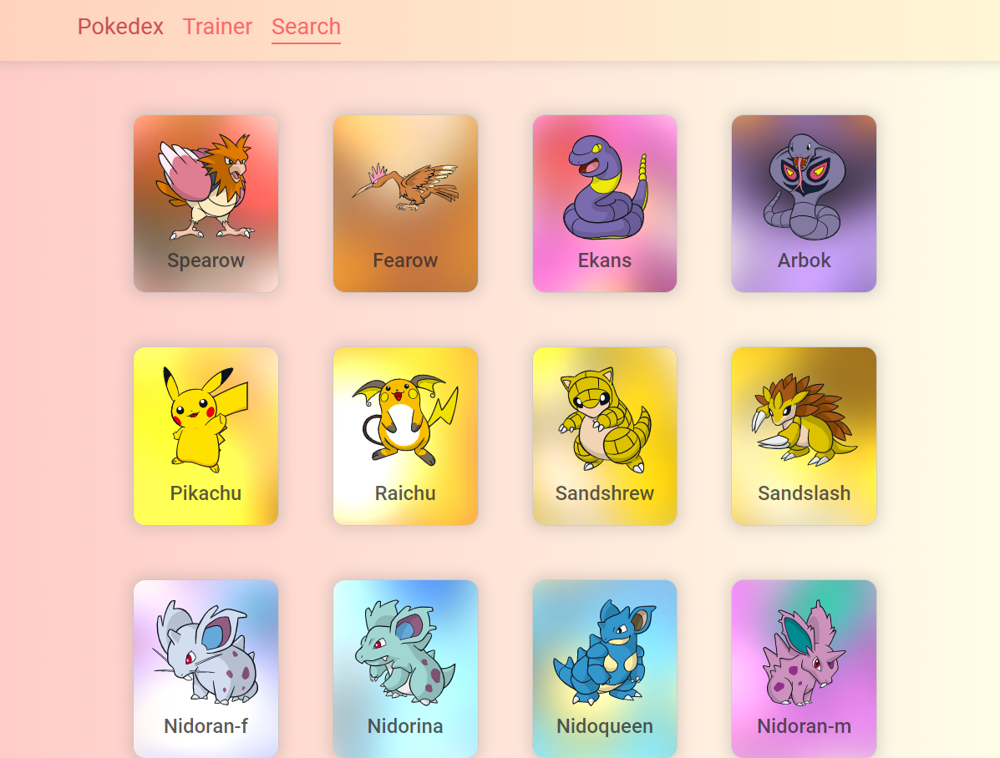
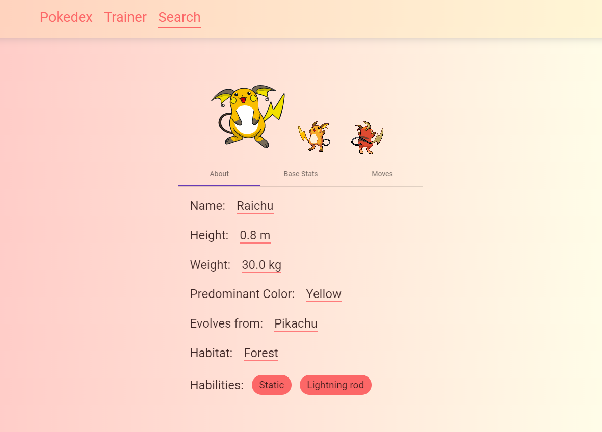
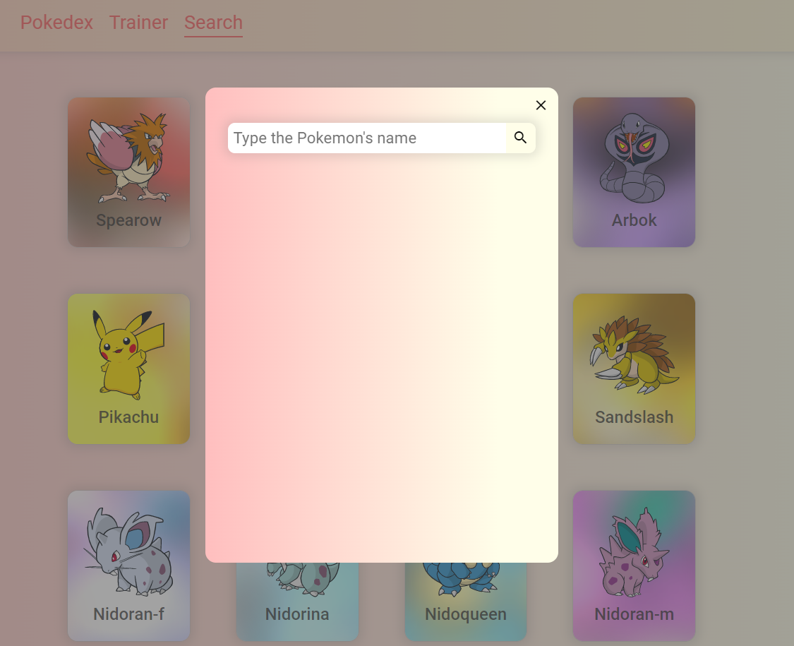
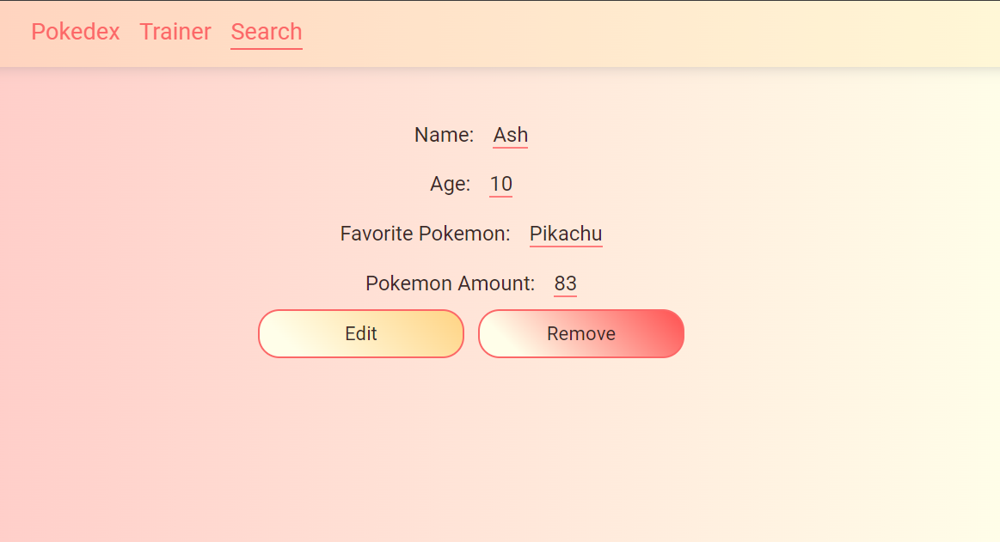

## Sobre

Este desafio teve como objetivo a criação de uma interface similar a pokedex. Na aplicação, em sua página inicial podemos ver uma listagem de pokemons. 

Ao clicar no botão "Load More" sempre no fim da página, será carregado mais pokemons na página.

Ao clicar em um card de pokemon, você será levado para uma página onde há informações detalhadas sobre o pokemon selecionado, nessa seção haverá informações como: altura, peso, habitat, lista de stats, lista de movimentos, e caso tenha evoluido de algum outro pokemon, essa informação estará disponível.

 Para pesquisar um pokemon pelo seu nome, basta clicar na opção "Search" no menu acima. Após fazer isso irá aparecer um campo onde será possível preencher o nome e pesquisar. Caso exista o pokemon, você verá o seu card e ao clicar nele, será levado para sua página especifica, caso não exista, aparecerá uma mensagem informando que não foi possível encontrar o pokemon.
 
 
 
 
Ao clicar na opção "Trainer" no menu principal você será redirecionado para seção de treinador. Caso exista informações sobre o seu perfil treinador ela está disponível, caso não tenha, haverá um aviso informando que não há registro e um botão "Register" que irá te redirecionar para página de registro do treinador. Na etapa de registro você deverá informar o nome, idade, pokemon favorito e quantidade de pokemons. Após clicar em registrar você será redirecionado para página do seu perfil. Lá esterá disponível as informações do seu perfil e também os botões "Edit" e "Remove". Ao clicar no botão "Edit" você será redirecionado para uma página onde será possível editar seus dados, que já estarão presentes no formulário. Ao clicar no botão "Remove" seu perfil será apagado.

## O que foi utilizado
- Typescript
- Angular 13 framework
- Angular Material 
- CSS3
- Testes Unitários
## Instruções para uso
- Clone esse repositório na sua máquina.
- Instale sua dependências utilizando o comando `npm install`
- Em seguida execute o comando `ng serve`
- Siga para o url `http://localhost:4200/`

### Obs:
- Esta aplicação está disponível neste [link](https://pokedex-challenge-3243.netlify.app/).
- Toda a aplicação é responsiva.
- As informações sobre o treinador estão sendo armazenadas no local storage do navegador.
- Aprendi diversas funcionalidade do Angular com a base que tinha desenvolvendo com a biblioteca React executando este projeto.
